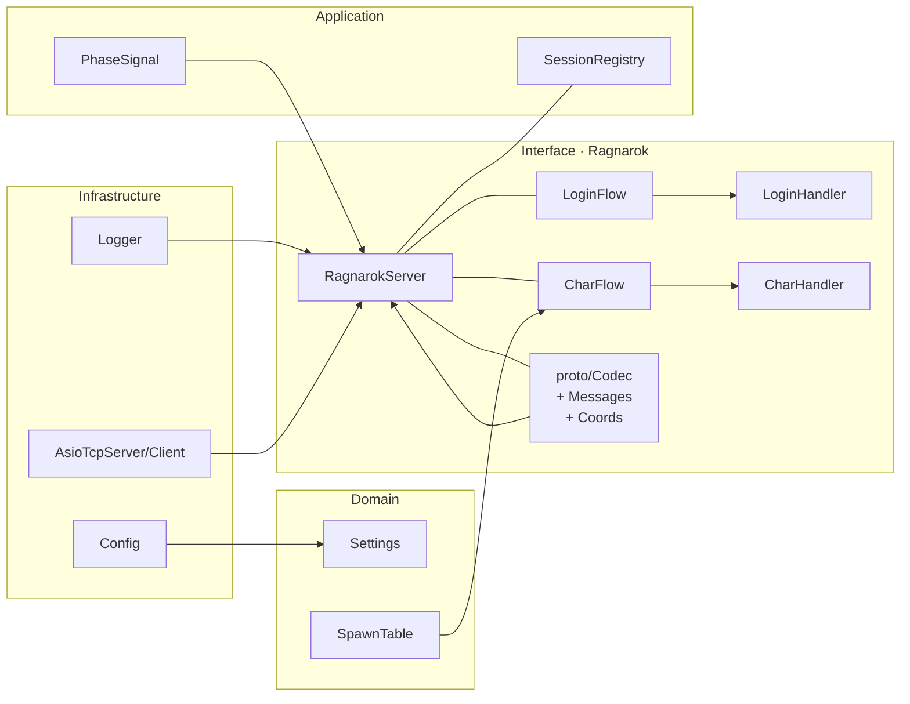

<a id="readme-top"></a>

<p align="center">
  
</p>

<h1 align="center">Thanatos <small style="font-weight:400"></small></h1>


<p align="center">
  <em><strong>Thanatos</strong> is a user-space <u>Ragnarok Online protocol terminator / emulator</u>.<br/>
  Inspired by the Perl “Poseidon”, now re-engineered in modern <b>C++20</b> with an async, testable core.</em>
</p>

<p align="center">
  <sub>
    ユーザ空間で動作する RO プロトコル終端エミュレータ。Perl 製「Poseidon」を継承し、C++20 で再設計・再実装。
  </sub>
</p>


<p align="center">
  <a href="#-features"></a>
  <a href="#-quickstart"></a>
  <a href="#-architecture"></a>
  <a href="#-license"></a>
</p>

<p align="center">
  
  &nbsp;&nbsp;&nbsp;
  
</p>

<p align="center" class="muted">
  <strong>Thanatos</strong> sits in front of the official <em>Ragnarok Online</em> client,
  terminating the <span class="sc">Login / Char / Map</span> handshake in user space.
  The official client connects to it in place of the live <code>login/char/map</code> servers.
  It services anti-cheat liveness (e.g., <abbr title="nProtect">GameGuard</abbr> / HackShield) locally,
  capturing the client’s genuine <em>challenge/response</em> and exposing a compact
  <span class="chip">Query&nbsp;Server</span> endpoint to <strong>OpenKore</strong>.
  In practice, <strong>Thanatos</strong> produces the exact artifacts the server expects,
  and OpenKore uses them to answer the official backend faithfully.
</p>

> ⚠️ **For Research/Education Only / 研究・教育目的のみ** — Do not use on third-party servers or in commercial environments. / 第三者サーバーや商用環境では使用しないでください。


<p align="center">
  
</p>

<p align="center">
  &nbsp;
  &nbsp;
  &nbsp;
  
</p>

## コンセプト / Concept

> 「光と闇、刃とコード。Thanatos はクライアントを“だます”ための最小限の世界を描く。」

* 🎮 **GameGuard ハンドシェイク**：seed/nonce、challenge/response、rolling checksum、心拍（heartbeat）。
* 🔌 **プロトコル終端**：Login / Char / Map の各フェーズを最小実装、サイズ／opcode 検証。
* 🤝 **OpenKore ブリッジ（計画）**：正規化した RO ストリームを転送、返信を注入。
* 🧱 **セーフなコーデック**：LE プリミティブ、境界チェック、opcode レジストリ。
* 🧼 **クリーンアーキテクチャ**：`domain → application → infrastructure → interface` の一方向依存。

<details>
  <summary><strong>English</strong> — Concept</summary>

- 🎮 **GameGuard handshake & heartbeats**: seed/nonce, challenge/response, rolling checksums, timers.
- 🔌 **Protocol terminator**: minimal Login/Char/Map phases with size/opcode validation.
- 🤝 **OpenKore bridge (planned)**: normalized RO stream → OpenKore, inject replies back.
- 🧱 **Safety‑first codec**: LE primitives, bounds checks, opcode registry.
- 🧼 **Clean Architecture**: single‑direction dependency: `domain → application → infrastructure → interface`.
</details>

---

## 🧭 Quickstart / はじめに

```powershell
# 依存関係の準備 / Setup dependencies
./scripts/setup-vcpkg.ps1

# ビルド（Release） / Build (Release)
./scripts/build-static.ps1

# 実行 / Run
./build/Release/Thanatos.exe
```

* `thanatos.toml`（ログ／ポート／スポーン初期値）を設定。
* クライアントが公式ドメイン固定の場合は **アドレス差し替え** を用意（詳細はクライアントビルド依存）。

<details>
  <summary><strong>English</strong> — Quickstart</summary>

- Configure `thanatos.toml` (logging, ports, spawn defaults).
- If your client is hard‑wired to official domains, prepare an **address replacer** (method depends on build).
</details>

---

## ✨ Features / 特徴

* **GameGuard**：クライアント側アンチチートの擬似応答で「健全」状態を維持。
* **Phase Machines**：Handshake → Auth → Redirect → Map Enter の順序を厳格に。
* **SessionRegistry**：フェーズ横断の接続追跡、`PhaseSignal` で遷移を可視化。
* **テスト**：gtest + ctest。コーデック、状態機械、境界条件を重視。

<details>
  <summary><strong>English</strong> — Features</summary>

- **GameGuard**: client‑side anti‑cheat emulation keeps the client “healthy”.
- **Phase machines**: strict order — Handshake → Auth → Redirect → Map Enter.
- **SessionRegistry** with **PhaseSignal** for cross‑phase lifecycle tracing.
- **Tests**: gtest + ctest with focus on codec, state machines, edge cases.
</details>

---

## 🧱 Architecture / アーキテクチャ



> 依存は内向きのみ：`domain ← application ← infrastructure ← interface`。

---

## 🕹️ Flow / フロー（実際にやること & 内部動作）

### 👣 What you actually do / 手順（ユーザー視点）

1. Configure `thanatos.toml` and launch **Thanatos**.
2. Point the RO client to **Thanatos** (Login/Char/Map). Address replacement is fine.
3. Start the game and **log in with any credentials** (no validation).
4. Enter the initial map (defaults come from SpawnTable/Coords).
5. Once stable, the client’s **heartbeat/health packets** are **mirrored/forwarded to the Query Server** endpoint.


### 🔧 Behind the scenes / 内部で起きていること

- Thanatos minimally implements Login/Char/Map to keep the client **healthy**.
- It **skips real authentication** (accepts any ID/PW) and fast-paths to **enter-map**.
- After entering the map, it maintains **heartbeats/rolling checksums** (GameGuard-style) with timers to avoid disconnects.
- Once stabilized, the **health/heartbeat stream** is **non-invasively duplicated** to the **Query Server** so external tools can subscribe without touching the live game socket.
- The Query Server is **one-way (server → query clients)**, ensuring safe observation.


---

## ⚙️ Requirements / 開発環境

| Item      | Versão / Detalhe                                |
| --------- | ----------------------------------------------- |
| OS        | Windows 10/11（Linux でもビルド可能）                    |
| Toolchain | Visual Studio 2022 / MSVC Build Tools 2022      |
| Build     | CMake ≥ 3.26 · vcpkg (manifest)                 |
| Deps      | `spdlog`, `tomlplusplus`, `boost-asio`, `gtest` |


---

## 🛠️ thanatos.toml — Annotated Example / 注釈付きサンプル

```toml
[app]
service_name = "Thanatos"

# Semantic version of your build
# ビルドのセマンティックバージョン
version      = "0.1.2"

# Verbose checks and extra diagnostics (disable in production)
# 詳細チェックと追加診断（本番では無効に）
debug        = false


[thanatos]
# Port for login handshake
# ログイン用ハンドシェイクのポート
login_port = 6900

# Port used by character server stub
# キャラクターサーバー用ポート
char_port  = 6121

[protocol]
# Maximum accepted packet size (bytes). 4 MiB = 4 * 1024 * 1024
# 受信パケットの最大サイズ（バイト）。4 MiB = 4 * 1024 * 1024
max_packet = 4_194_304


[query]
# Max buffer for query server (bytes). 1 MiB is usually safe.
# クエリサーバーの最大バッファ（バイト）。1 MiB が無難
max_buf = 1_048_576


[net]
# Overrides source IP when needed (0.0.0.0 = disabled/auto)
# 必要に応じて送信元 IP を上書き（0.0.0.0 = 無効/自動）
query_host = "0.0.0.0"

# Max queued writes per socket (protects memory pressure)
# ソケット毎の送信キュー上限（メモリ圧迫の防止）
max_write_queue = 1024

# Disable Nagle to reduce latency
# 遅延削減のため Nagle 無効化
tcp_nodelay = true

# Keep TCP alive to detect dead peers
# 相手切断の検知用に TCP KeepAlive を有効化
tcp_keepalive = true


[log]
# Log level: trace|debug|info|warn|error
# ログレベル：trace|debug|info|warn|error
level = "info"

# Write logs to file (false = console only)
# ファイルへ出力（false の場合はコンソールのみ）
to_file = false

# Log file path (used when to_file = true)
# ログファイルのパス（to_file=true のとき使用）
file = "logs/thanatos.log"

# Keep up to N rotated files
# ローテーションファイルの最大保持数
max_files = 3

# Rotate when file exceeds this size (bytes)
# このサイズ（バイト）を超えたらローテーション
max_size_bytes = 2_097_152
```

---

## ⚡Scripts / スクリプト

```powershell
# vcpkg セットアップ / Setup vcpkg
./scripts/setup-vcpkg.ps1
# ビルド / Build
./scripts/build-static.ps1
# テスト / Tests
./scripts/run-tests.ps1 -Config Release
```
<p align="right">(<a href="#readme-top">back to top</a>)</p>

## 📜 License / ライセンス

MIT — `LICENSE` を参照。

---

<h2 id="thanks">🙌 Thanks / 謝辞</h2>


<ul>
  <li><a href="https://github.com/OpenKore/openkore">OpenKore</a> community</li>
</ul>

<div style="clear: both;"></div>


