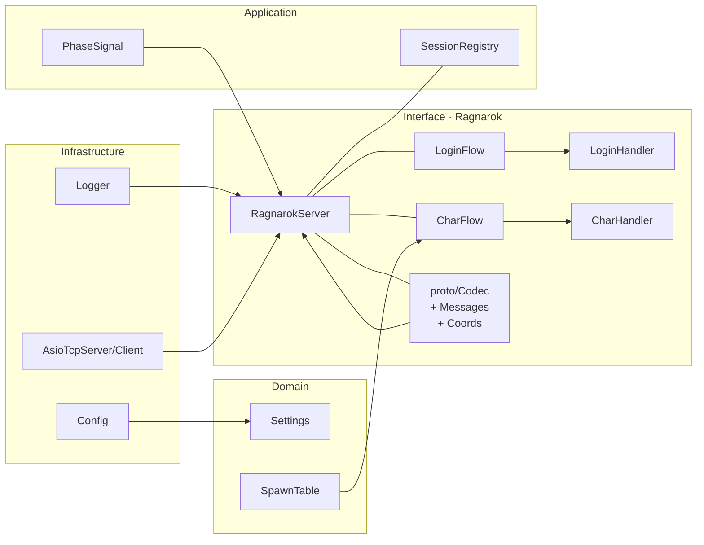

<p align="center">
  
  &nbsp;&nbsp;&nbsp;&nbsp;&nbsp;
  
</p>

<h1 align="center">Arkan Poseidon</h1>

<p align="center">
  <em>User-space Ragnarok Online server emulator and protocol terminator, inspired by the original Poseidon project written in Perl, now fully rewritten and refactored in modern C++20. Poseidon implements the client-side anti-cheat (GameGuard) handshake/heartbeats and then relays a normalized RO packet stream to OpenKore for control and automation.</em><br/>
</p>

> ⚠️ This is a **research/educational** project. Do not use on third-party servers or in production environments.

---

## ✨ Overview

**Arkan Poseidon** is a purpose-built RO server emulator that terminates the official client on the three classic endpoints (Login, Char, Map) and speaks just enough of the protocol to keep the client authenticated and alive without contacting an official server. The emulator:

**Implements GameGuard** flow: handles seed/nonce derivation, challenge/response, rolling checksums and periodic heartbeats so the RO client believes it is talking to a legitimate server with anti-cheat enabled.

**Acts as a protocol** terminator: accepts TCP sessions on login/char/map ports, runs per-phase state machines (handshake → auth → redirect → map enter), validates lengths/opcodes, and synthesizes minimal state blocks (identity, spawn, coordinates).

**Bridges to OpenKore**: after the client is stable, Poseidon forwards a sanitized packet stream (raw RO opcodes or a framed envelope) to OpenKore over a dedicated TCP link; replies generated by OpenKore can be injected back to the client through Poseidon.

**Provides a strict codec layer**: little-endian primitives, bounds checks, opcode registry, and safe readers/writers that prevent over-reads and malformed frames.

Under the hood, Poseidon uses Boost.Asio for networking, spdlog for logging, toml++ for configuration, and a Clean Architecture layout (domain/application/infrastructure/interface) to keep protocol logic isolated and testable.

---

## 🧱 Architecture



**Dependency rule (inward only):** `domain ← application ← infrastructure ← interface`.

---

## 🔧 How it works (Login → Char → Map)

1. **Bootstrap/Main**
   - Loads `poseidon.toml`, initializes **Logger** and **Asio** services, starts **RagnarokServer**.
2. **Login phase**
   - Accepts client connection, performs minimal handshake/validation, then issues **Char server redirect**.
3. **Char phase**
   - Handles character listing/selection.
   - On selection, emits **enter-map** handshake: redirect + acceptance and base state.
4. **Map entry**
   - Sends minimal identity/state packets and spawn info using **Coords** helpers and **SpawnTable** defaults.
5. **Session lifecycle**
   - **SessionRegistry** tracks connections across phases.
   - **PhaseSignal** communicates transitions for clean logging and debugging.
6. **Planned**
   - **GameGuard** challenge/response hook (handshake & timers).
   - **OpenKore** bridge mode for end-to-end lab tests.

---

## 📁 Layout

```
src/
├─ application/
│  ├─ ports/
│  │  └─ net/
│  │     ├─ IConnectionHandler.hpp
│  │     ├─ ISession.hpp
│  │     └─ ITcpServer.hpp
│  └─ state/
│     ├─ SessionRegistry.hpp
│     └─ SessionRegistry.cpp
├─ domain/
├─ infrastructure/
│  ├─ config/
│  │  ├─ Config.hpp
│  │  └─ Config.cpp
│  ├─ log/
│  │  ├─ Logger.hpp
│  │  └─ Logger.cpp
│  └─ net/
│     ├─ AsioTypes.hpp
│     └─ asio/
│        ├─ AsioTcpClient.hpp
│        ├─ AsioTcpClient.cpp
│        ├─ AsioTcpServer.hpp
│        └─ AsioTcpServer.cpp
├─ interface/
│  ├─ bootstrap/
│  │  └─ Main.cpp
│  ├─ dev/
│  │  ├─ RoBridgeHandler.hpp
│  │  └─ RoBridgeHandler.cpp
│  ├─ query/
│  │  ├─ QueryProtocol.hpp
│  │  ├─ QueryHandler.hpp
│  │  └─ QueryHandler.cpp
│  └─ ragnarok/
│     ├─ RagnarokServer.hpp
│     ├─ RagnarokServer.cpp
│     ├─ login/
│     │  ├─ LoginFlow.hpp
│     │  ├─ LoginFlow.cpp
│     │  ├─ LoginHandler.hpp
│     │  └─ LoginHandler.cpp
│     ├─ char/
│     │  ├─ CharFlow.hpp
│     │  ├─ CharFlow.cpp
│     │  ├─ CharHandler.hpp
│     │  └─ CharHandler.cpp
│     ├─ model/
│     │  ├─ PhaseSignal.hpp
│     │  └─ SpawnTable.hpp
│     └─ proto/
│        ├─ Codec.hpp
│        ├─ Codec.cpp
│        ├─ Coords.hpp
│        ├─ LoginMessages.hpp
│        └─ Messages.hpp
├─ shared/
│  ├─ BuildInfo.hpp
│  ├─ Hex.hpp
│  └─ Utils.hpp
└─ tests/
```

---

## 🧪 Requirements

- **Windows 10/11** (Linux builds are possible)
- **Visual Studio 2022 / MSVC Build Tools 2022**
- **CMake ≥ 3.26**
- **vcpkg** (manifest mode)

**Dependencies (via vcpkg):** `spdlog`, `tomlplusplus`, `boost-asio` (and Boost core), `gtest`.

---

## 📦 Setup

Use the helper script already included in this repository:

```powershell
# From the repo root
.\scripts\setup-vcpkg.ps1
```

---

## 🛠️ Build

Use the build script in the `scripts` folder:

```powershell
.\scripts\build-release-standalone.ps1   # builds Release by default
```

---

## ▶️ Run

> **Prerequisites**
> - `poseidon.toml` properly configured (logging, server bindings, spawn defaults).
> - A Ragnarok Online client (lab copy) that you can point to custom **Login/Char/Map** endpoints.
> - If the client is hardcoded to official domains/ports, you will need an **address replacer** or equivalent patching mechanism to rewrite the in‑process pointers the game uses for hostname/port resolution. *Details are intentionally omitted; the exact method depends on the client build and is outside the scope of this repo.*

### 1) Start the emulator

```powershell
# From the repository root, after building
.\build\Release\arkan-poseidon.exe
```

- Poseidon binds the ports defined in `[server]`:
  - `loginHost:loginPort` (default `0.0.0.0:6900`)
  - `charHost:charPort`   (default `0.0.0.0:6121`)
  - `mapHost:mapPort`     (default `0.0.0.0:5121`)
- Logs are written according to `[logging]`. Enable console via `showConsole=true`.
- `SessionRegistry` will print per‑phase connection entries as clients attach/detach.

### 2) Point the RO client to Poseidon

There are two common approaches:

1. **Client configuration** (preferred if available): some clients support an external config or command‑line that allows overriding the login host/port. Point it to `loginHost:loginPort` from `poseidon.toml`.
2. **Address replacement / pointer patching**: for clients that resolve server addresses internally, use an *address replacer* to patch the in‑memory pointers/structs the client uses to store:
   - Login host/port, Char host/port (from redirect), Map host/port.
   - Optional DNS strings and multi‑server tables.
   
   > This project does **not** provide patching tooling. Ensure the patch focuses only on network endpoints; do not alter executable logic. Keep a reversible workflow for compliance and testing.

### 3) Expected sequence (high‑level)

Once the client connects to the Poseidon **Login** endpoint:

1. **Login phase**: Poseidon accepts TCP, performs the minimal handshake and validates packet sizes/opcodes.
2. **GameGuard**: Poseidon executes the client‑side anti‑cheat exchange (seed/nonce, challenge/response, rolling checksum, periodic heartbeats). The client must remain in “healthy” state (no disconnects/timeouts).
3. **Redirect to Char**: client receives redirect and connects to Poseidon’s **Char** endpoint.
4. **Character selection**: client lists/selects a character.
5. **Enter Map**: Poseidon accepts on **Map**, emits acceptance/state blocks and spawn using `SpawnTable`/`Coords`. Coordinates are clamped to valid ranges per map.

When stable, if **OpenKore** is used, Poseidon can forward a normalized packet stream to OpenKore for automation and inject its replies back to the client (bridge mode).

---

## ⚙️ Configuration (`poseidon.toml`)

```toml
[app]
service_name = "Arkan-Poseidon"
version      = "0.1.0"
debug        = false

[poseidon]
login_port = 6900
char_port  = 6121
ro_port    = 5121

[openkore]
port = 5293

[protocol]
max_packet = 4194304    # 4 MiB

[query]
max_buf = 1048576       # 1 MiB

[net]
fakeIP = "0.0.0.0"
max_write_queue = 1024
tcp_nodelay = true
tcp_keepalive = true

[log]
level = "info"
to_file = false
file = "logs/poseidon.log"
max_files = 3
max_size_bytes = 2097152

```

---


## ✅ Tests

Arkan Poseidon ships with a **GoogleTest** test suite, orchestrated by **CTest**. Tests are designed to validate the behavior of each layer independently (codec, protocol, state machines) and in small integration hops (Login → Char → Map). The goals are **determinism**, **bounds safety**, and **protocol correctness** under malformed input.

### Running

You can execute tests either via **CTest** or using the helper script already in the repo:

```powershell
# Using the script (recommended)
.\scripts\run-tests.ps1 -Config Release
# or Debug
.\scripts\run-tests.ps1 -Config Debug
```

Filter tests:
```powershell
# By suite or name fragments
ctest -R Codec -C Release --output-on-failure
ctest -R RagnarokServer -C Release --output-on-failure
```

### What is covered

- **Codec & Messages**: LE read/write, size validation, opcode dispatch, malformed-frame rejection.
- **Coords & SpawnTable**: clamping, map bounds, default spawns, invalid input fallbacks.
- **Login/Char state machines**: sequence enforcement (handshake → auth → redirect → enter), timeout conditions.
- **SessionRegistry**: add/remove semantics, per-phase lifecycle, concurrency-safety boundaries.
- **Config & Logger**: minimal parsing sanity and log routing (file vs console).

---

## 📜 License

MIT — see `LICENSE`.

---

## 🙌 Acknowledgements

- [OpenKore](https://github.com/OpenKore/openkore) community
- spdlog, Boost, GoogleTest, toml++
- Microsoft vcpkg team

---
